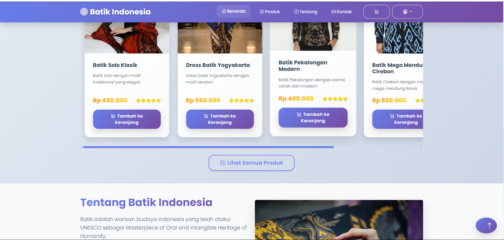
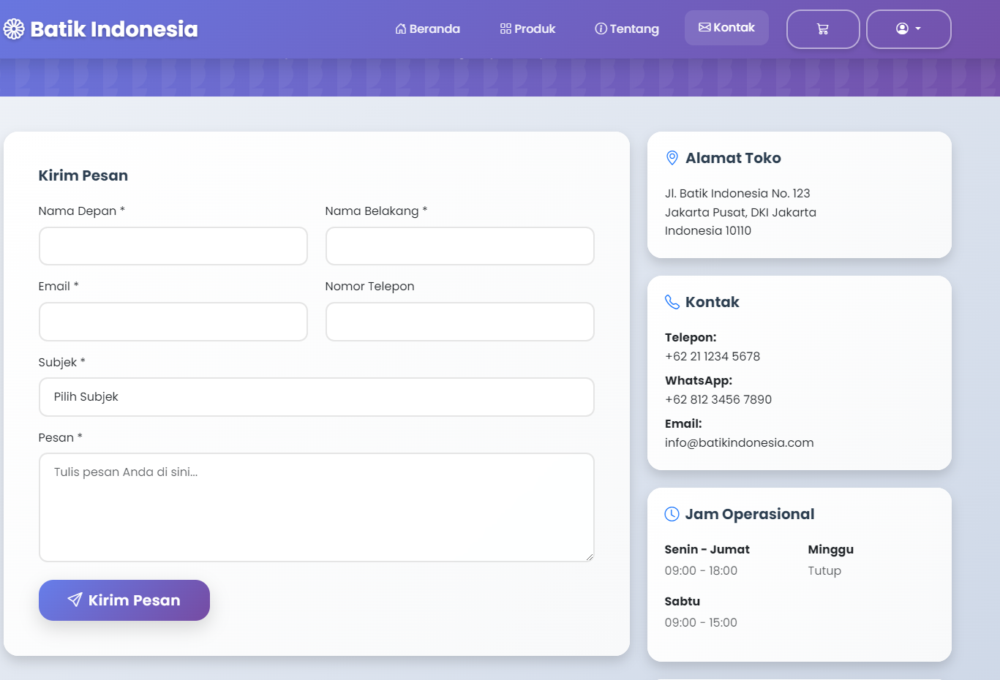

# Batik Indonesia - E-commerce Website

Website e-commerce untuk penjualan batik Indonesia dengan berbagai motif tradisional dan modern.

## Fitur Utama

- **Katalog Produk** - Koleksi batik dari berbagai daerah Indonesia

- **Keranjang Belanja** - Sistem cart dengan update quantity real-time
- **Responsive Design** - Tampilan optimal di desktop dan mobile
- **Informasi Daerah** - Detail batik berdasarkan asal daerah

- **Halaman Kontak** - Form komunikasi dengan penjual

## Teknologi

- **HTML5** - Struktur halaman
- **CSS3** - Styling dan animasi
- **JavaScript** - Interaktivitas dan cart system
- **Bootstrap 5** - Framework CSS responsive
- **Bootstrap Icons** - Icon set

## Cara Menjalankan

1. Clone repository ini
2. Buka `index.html` di browser
3. Atau gunakan live server untuk development

## Halaman Tersedia

- **Beranda** (`index.html`) - Landing page dengan produk unggulan
- **Produk** (`products.html`) - Katalog lengkap produk batik
- **Keranjang** (`cart.html`) - Review dan checkout produk
- **Daerah** (`regions.html`) - Informasi batik per daerah
- **Tentang** (`about.html`) - Sejarah dan informasi batik
- **Kontak** (`contact.html`) - Form komunikasi

## Preview

Website menampilkan koleksi batik Indonesia dengan desain modern dan user-friendly, dilengkapi sistem keranjang belanja yang mudah digunakan.

belum fix
